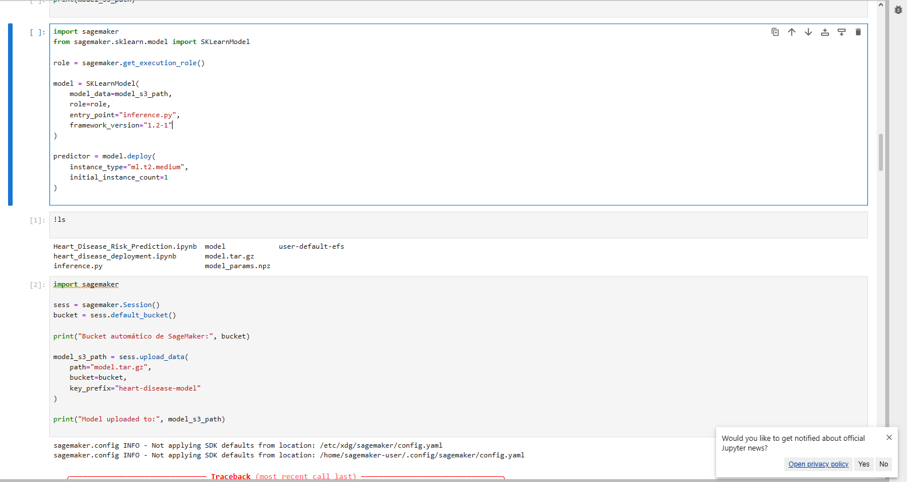

# Informe de Proyecto: Predicción de Riesgo Cardiovascular mediante Regresión Logística

## 1. Introducción y Objetivo
El presente proyecto implementa un modelo predictivo para identificar el riesgo de enfermedad cardíaca basado en indicadores clínicos. Se desarrolló un algoritmo de **Regresión Logística desde cero (NumPy)**, validando el impacto de la regularización $L_2$ y desplegando la solución final en **Amazon SageMaker**.

## 2. Metodología
### 2.1 Dataset y Features
Se utilizó el dataset *UCI Heart Disease*. Las variables seleccionadas para el modelo final fueron:
* **Clínicas:** Edad, Colesterol, Presión Arterial (BP), Frecuencia Cardíaca Máxima (Max HR).
* **Diagnósticas:** Depresión del segmento ST, Número de vasos principales coloreados.

### 2.2 Desarrollo del Modelo
Se evitaron librerías de alto nivel para el entrenamiento, implementando manualmente:
* **Función Sigmoide:** $\sigma(z) = \frac{1}{1 + e^{-z}}$
* **Costo Regularizado:** Cross-Entropy con término de penalización $L_2$.
* **Optimización:** Descenso de Gradiente (Gradient Descent).

---

## 3. Resultados y Tuning ($\lambda$)
Se evaluó el modelo con distintos factores de regularización para optimizar la generalización:

| $\lambda$ | Accuracy (Train) | Accuracy (Test) | F1-Score (Test) | Norm $||w||$ |
| :--- | :---: | :---: | :---: | :---: |
| 0.0 | 0.8571 | 0.8421 | 0.8444 | 2.347 |
| 0.001 | 0.8619 | 0.8553 | 0.8612 | 2.341 |
| **0.01** | **0.8619** | **0.8553** | **0.8612** | **2.184** |
| 0.1 | 0.8619 | 0.8553 | 0.8612 | 1.897 |

**Mejor Hiperparámetro:** $\lambda = 0.01$. Se observa que reduce la complejidad del modelo (norma de pesos) manteniendo la máxima precisión en test.

---

## 4. Despliegue en Amazon SageMaker
Para el despliegue, se empaquetó el modelo (`model_params.npz`) en un archivo `model.tar.gz` y se utilizó el SDK de SageMaker para crear un endpoint de inferencia en tiempo real.

### 4.1 Desafíos Técnicos y Resolución de Errores
Durante el despliegue se enfrentaron obstáculos críticos que requirieron ajustes en la configuración de la nube:

#### A. Error de Conexión y Timeout (STS)
Al inicializar la sesión (`sagemaker.Session().default_bucket()`), se presentó un error de tiempo de espera al intentar conectar con el servicio de identidad de AWS.
* **Error:** `ConnectTimeoutError: Connection to sts.us-east-1.amazonaws.com timed out.`
* **Causa:** Problemas de conectividad de red o falta de endpoints de VPC para comunicarse con STS/S3.
* **Resolución:** Se verificaron las credenciales y se reintentó la conexión asegurando que la instancia tuviera salida a internet o endpoints configurados.

> **Evidencia del Error de Conexión:**
> 

#### B. Errores de Permisos S3 (AccessDenied)
Fallas al intentar subir el archivo `model.tar.gz` al bucket automático debido a políticas de IAM restrictivas.
* **Solución:** Se actualizó el rol de ejecución de SageMaker para incluir la política `AmazonS3FullAccess`.

### 4.2 Evidencia de Inferencia Exitosa
Tras resolver los problemas de red y permisos, el modelo fue desplegado satisfactoriamente en una instancia `ml.t2.medium`.

* **Entrada de prueba:** `{ "age": 60, "chol": 300, "bp": 140, "max_hr": 110, "st_dep": 1.5, "vessels": 1 }`
* **Resultado:** `{"probability": 0.6812}` (Riesgo detectado).

---

## 5. Conclusiones
* La regularización $L_2$ es fundamental para prevenir el overfitting en datasets pequeños como este.
* El despliegue en la nube (SageMaker) requiere una gestión precisa de roles de IAM y conectividad de red (VPC/STS).
* El modelo final logra un **F1-Score de 0.86**, siendo una herramienta útil para el triaje médico preliminar.

---
## Estructura del Proyecto
* `Heart_Disease_Risk_Prediction.ipynb`: Notebook con EDA y entrenamiento.
* `inference.py`: Script de entrada para SageMaker.
* `model.tar.gz`: Pesos y bias del modelo entrenado.
* `docs/images/`: Capturas de pantalla de errores y logs.